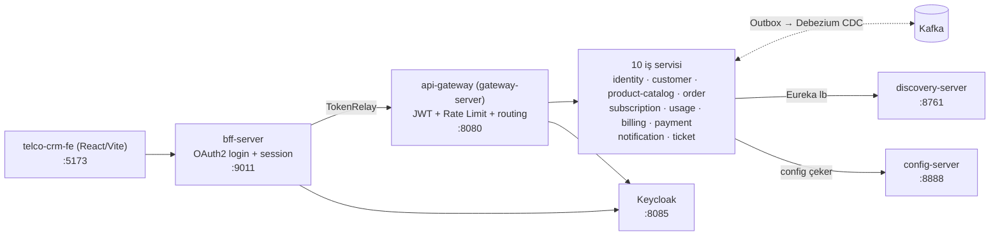
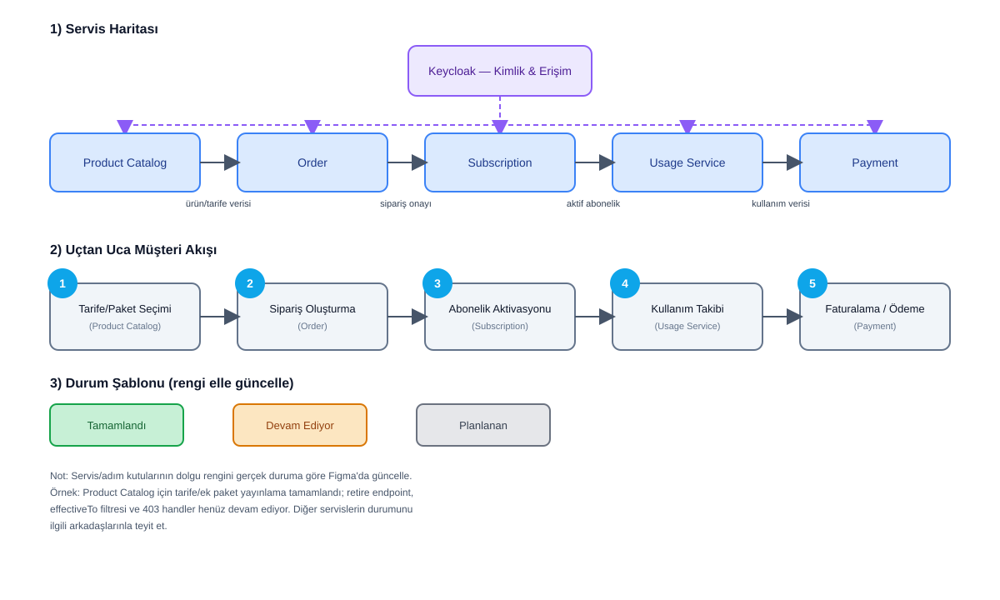

# Telco CRM — Mikroservis Platformu

## Proje Hakkında

Bir mobil operatör için uçtan uca CRM platformu: müşteri kaydı/KYC, tarife/ek paket kataloğu, sipariş → ödeme → abonelik aktivasyonu **saga** akışı, kullanım (CDR) takibi, faturalama, destek talepleri ve bildirimleri kapsar. Servisler arasındaki tüm asenkron iletişim **Transactional Outbox + Debezium CDC** ile Kafka'ya taşınır; senkron çağrılar OpenFeign + Resilience4j Circuit Breaker ile korunur.

---

## Mimari



Her servisin kendi Postgres veritabanı vardır (bkz. Servis Yapısı tablosu); servis-servis event akışlarının detayı ilgili servisin dokümanındaki "Kafka Event'leri" bölümündedir.



---

## Teknoloji Yığını

| Kategori | Teknolojiler |
|---|---|
| Backend Core | Java 21, Spring Boot, Spring Cloud (Eureka, Config Server, Gateway, OpenFeign) |
| İletişim | REST (OpenFeign), Apache Kafka + Spring Cloud Stream, Debezium CDC (Transactional Outbox) |
| Veri & Cache | PostgreSQL (servis başına ayrı DB, Flyway ile şema yönetimi), Redis (cache + rate-limit + session) |
| Güvenlik | Keycloak (OIDC), Spring Security OAuth2 Resource Server, JWT |
| Dayanıklılık | Resilience4j (Circuit Breaker) |
| Gözlemlenebilirlik | Zipkin (distributed tracing), Micrometer/OpenTelemetry, Loki + Promtail + Grafana (merkezi log), ECS log formatı + Correlation-Id |
| Nesne eşleme | MapStruct |
| DevOps & Altyapı | Docker Compose (lokal), Kubernetes manifestleri (`k8s/`), Maven (çok modüllü) |
| Frontend | React 18, Vite, TypeScript, Tailwind CSS |

---

## Servis Yapısı

| Servis | Port | Sorumluluk | README |
|---|---|---|---|
| `discovery-server` | 8761 | Eureka servis kayıt/keşif | [discovery-server/README.md](discovery-server/README.md) |
| `config-server` | 8888 | Merkezi konfigürasyon (native profil, `configs/`) | [config-server/README.md](config-server/README.md) |
| `api-gateway` (`gateway-server`) | 8080 | JWT doğrulama, rate limiting, servislere routing |[gateway-server/README.md](api-gateway/README.md)  |
| `bff-server` | 9011 | Frontend için oturum bazlı OAuth2 login, gateway'e TokenRelay | [bff-server/README.md](bff-server/README.md) |
| `identity-service` | 9001 | User/Role/Permission CRUD + Keycloak senkronizasyonu (best-effort) | [identity-service/README.md](identity-service/README.md) |
| `customer-service` | 9002 | Müşteri, adres, belge, KYC yönetimi | [customer-service/README.md](customer-service/README.md) |
| `product-catalog-service` | 9003 | Tarife/ek paket kataloğu (ürün tanımlarının tek kaynağı) | [product-catalog-service/README.md](product-catalog-service/README.md) |
| `order-service` | 9004 | Sipariş yaşam döngüsü, saga orkestrasyonu | [order-service/README.md](order-service/README.md) |
| `subscription-service` | 9005 | Abonelik yaşam döngüsü (aktivasyon/askı/sonlandırma) | [subscription-service/README.md](subscription-service/README.md) |
| `usage-service` | 9006 | CDR tüketimi, kota takibi, eşik/aşım olayları | [usage-service/README.md](usage-service/README.md) |
| `billing-service` | 9007 | Fatura döngüsü ve fatura üretimi | [billing-service/README.md](billing-service/README.md) |
| `payment-service` | 9008 | Ödeme tahsilatı, retry, iade (mock PSP) | [payment-service/README.md](payment-service/README.md) |
| `notification-service` | 9009 | Platform genelindeki olayları e-posta/SMS'e çevirir | [notification-service/README.md](notification-service/README.md) |
| `ticket-service` | 9010 | Destek talepleri + SLA ihlali tarayıcısı | [ticket-service/README.md](ticket-service/README.md) |
| `telco-crm-fe` | 5173 | React tabanlı CRM arayüzü | [telco-crm-fe/README.md](telco-crm-fe/README.md) |


---

## Kurulum (Getting Started)

### Ön Gereksinimler
- JDK 21, Maven 3.x
- Docker + Docker Compose
- Node.js 18+ (frontend için)

### 1. Repoyu klonlayın
```bash
git clone <git@github.com:arshmed/telco-crm.git>
cd telco-crm
```

### 2. Altyapıyı ayağa kaldırın
Postgres (servis başına 10 ayrı DB), Kafka, Debezium Connect, Redis, Keycloak, Zipkin, Loki/Grafana, Kafka UI, pgAdmin dahil:
```bash
docker compose -f docker/docker-compose.yml up -d
```

Debezium connector'larını kaydedin (atlanırsa outbox event'leri Kafka'ya hiç taşınmaz):
```bash
./docker/register-connectors.sh
```

> Keycloak realm'i `keyclock/realm-export.json`'dan import edilir. Konteyner restart realm'i silmez ama `--import-realm` mevcut bir realm'i **atlar** — dosyadaki güncel hâli yüklemek için konteyneri `--force-recreate` ile yeniden oluşturmak gerekir.

### 3. Servisleri başlatın
`run-dev.ps1`, config-server/discovery-server/gateway/bff'i doğru sırayla ayağa kaldırır ve verdiğiniz servisleri ek olarak başlatır:
```powershell
.\run-dev.ps1 ticket-service customer-service
```
Veya tek bir servisi Maven ile:
```bash
mvn -pl order-service spring-boot:run
```

### 4. Frontend'i başlatın
```bash
cd telco-crm-fe
npm install
npm run dev   # http://localhost:5173
```

---

## Endpoint'ler & Dashboard'lar

| Araç | URL | Not |
|---|---|---|
| Frontend | http://localhost:5173 | CRM arayüzü |
| API Gateway | http://localhost:8080 | Servislere tek giriş noktası |
| Eureka | http://localhost:8761 | Servis kayıt durumu |
| Keycloak | http://localhost:8085 | Realm: `telcocrm-gygy5` |
| Kafka UI | http://localhost:8090 | Topic/consumer-group izleme |
| Zipkin | http://localhost:9411 | Distributed tracing |
| Grafana | http://localhost:3000 | Log/metrik dashboard'ları (Loki) |
| pgAdmin | http://localhost:5050 | Postgres yönetimi |

> Compose'da tanımlı MinIO (`9000`/`9090`) henüz hiçbir servisten kullanılmıyor — ileride dosya/belge depolama için ayrılmış durumda.

---

## Test

Her modülde `spring-boot-starter-test` (JUnit 5 + Mockito) ile birim testleri var:
```bash
mvn test                    # tüm modüller
mvn -pl payment-service test # tek servis
```
---

## Katkıda Bulunanlar

- Fatmatüzzehra Öztürk: https://github.com/zehraozturkk
- Orhan Gölcür: https://github.com/orhangolcur
- Muhammed Arslan: https://github.com/arshmed

