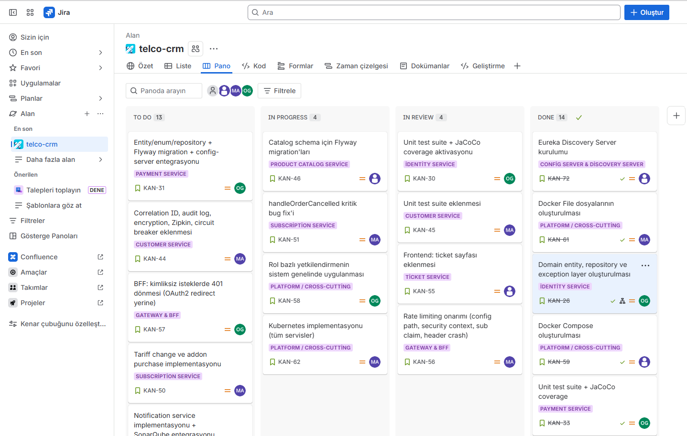
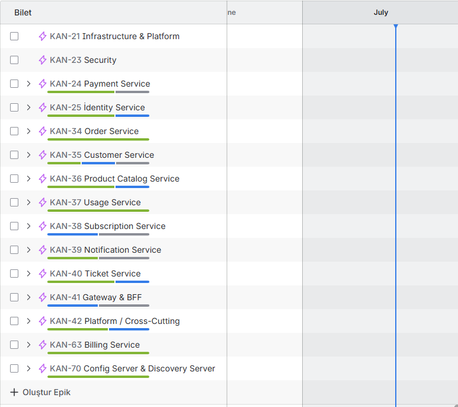

# TelcoX CRM Platformu - Kapsamlı Teknik Doküman


## İçindekiler

1. [Yönetici Özeti](#1-yönetici-özeti)
2. [Proje Kapsamı & Hedefler](#2-proje-kapsamı--hedefler)
3. [Sistem Mimari Tasarımı](#3-sistem-mimari-tasarımı)
4. [Teknoloji Yığını](#4-teknoloji-yığını)
5. [Servis Detayları](#5-servis-detayları)
6. [API Dokümantasyonu](#6-api-dokümantasyonu)
7. [Veritabanı Şeması & Entity İlişkileri](#7-veritabanı-şeması--entity-i̇lişkileri)
8. [Frontend Arayüzleri & Kullanıcı Akışları](#8-frontend-arayüzleri--kullanıcı-akışları)
9. [Güvenlik & Yetkilendirme](#9-güvenlik--yetkilendirme)
10. [Event-Driven Mimarisi & Kafka Akışları](#10-event-driven-mimarisi--kafka-akışları)
11. [DevOps, Deploy & Altyapı](#11-devops-deploy--altyapı)
12. [Test Stratejisi & Kalite Güvencesi](#12-test-stratejisi--kalite-güvencesi)
13. [Teknik Borç & İyileştirme Yol Haritası](#13-teknik-borç--iyileştirme-yol-haritası)
14. [Proje Planı & Jira İş Takibi](#14-proje-planı--jira-i̇ş-takibi)

---

# 1. Yönetici Özeti

## 1.1 Proje Tanımı

TelcoX CRM Platformu, bir telekomünikasyon operatörünün tüm müşteri yaşam döngüsünü yönetmek üzere tasarlanmış **mikroservis tabanlı, event-driven bir kurumsal CRM platformudur**. Platform; müşteri kayıt/KYC, tarife/addon katalog yönetimi, siparişten ödeme ve abonelik aktivasyonuna kadar tüm süreçleri **Saga orkestrasyon** deseniyle entegre şekilde yönetir.

# 2. Proje Kapsamı & Hedefler

## 2.1 Kapsam

Platform aşağıdaki iş süreçlerini kapsar:

```
┌─────────────────────────────────────────────────────────────────────┐
│                        İŞ SÜREÇLERI                                 │
├─────────────────────────────────────────────────────────────────────┤
│  1. Müşteri Yönetimi     → Kayıt, KYC, adres/belge yönetimi        │
│  2. Ürün Kataloğu        → Tarife versiyonlama, addon paketleri     │
│  3. Sipariş Yönetimi     → Sipariş oluşturma, Saga orkestrasyon    │
│  4. Abonelik Yönetimi    → Aktivasyon, askıya alma, sonlandırma    │
│  5. Kullanım Takibi      → CDR işleme, kota yönetimi               │
│  6. Faturalama           → Fatura döngüsü, PDF oluşturma           │
│  7. Ödeme Yönetimi       → Ödeme işleme, iade, yeniden deneme      │
│  8. Bildirim Yönetimi    → E-posta/SMS bildirimleri, şablonlar      │
│  9. Destek Talepleri     → Ticket oluşturma, SLA izleme            │
│  10. Yönetim Paneli      → Kullanıcı/rol yönetimi, erişim logları  │
└─────────────────────────────────────────────────────────────────────┘
```

## 2.2 Hedef Kitle Kullanıcıları

| Rol | Yetkiler | Ana Kullanım Alanları |
|---|---|---|
| **Sistem Yöneticisi (admin)** | Tüm yetkiler | Kullanıcı yönetimi, sistem yapılandırması |
| **Müşteri Temsilcisi (CALL_CENTER_AGENT)** | KYC onay, ticket yönetimi | Müşteri hizmetleri, destek talepleri |
| **Saha Personeli (FIELD_DEALER)** | KYC onay, sipariş | Müşteri kaydı, abonelik satışı |
| **Pazarlama Müdürü (MARKETING_MANAGER)** | Katalog yönetimi | Tarife/addon oluşturma, fiyatlandırma |
| **Faturalama Operatörü (BILLING_OPERATOR)** | Fatura yönetimi | Fatura oluşturma, ödeme takibi |
| **Müşteri (CUSTOMER)** | Kendi verileri | Self-servis portal (gelecek aşama) |

## 2.3 Proje Aşamaları

| Aşama | Durum | Kapsam |
|---|---|---|
| **Faz 1 - Temel Altyapı** | Tamamlandı | Mikroservis altyapısı, servis keşfi, config, gateway |
| **Faz 2 - İş Servisleri** | Tamamlandı | 10 iş servisi, veritabanları, API'ler |
| **Faz 3 - Event Mimarisi** | Tamamlandı | Kafka, Debezium CDC, outbox pattern |
| **Faz 4 - Frontend** | Tamamlandı | React SPA, tüm sayfalar, tasarım sistemi |
| **Faz 5 - Güvenlik** | Tamamlandı | Keycloak, JWT, roller, yetkilendirme |
| **Faz 6 - Observability** | Tamamlandı | Zipkin, Loki, Grafana, distributed tracing |
| **Faz 7 - Üretim Hazırlığı** | Devam Ediyor | Hardening, performans testi, security audit |

---

# 3. Sistem Mimari Tasarımı

## 3.1 Genel Mimari Gösterim

```
┌─────────────────────────────────────────────────────────────────────────────┐
│                              FRONTEND (React SPA)                          │
│                          Port: 5173 | Vite + Tailwind                      │
└─────────────────────────────┬───────────────────────────────────────────────┘
                              │ HTTPS
┌─────────────────────────────▼───────────────────────────────────────────────┐
│                         API GATEWAY (Spring Cloud Gateway)                 │
│                    Port: 8080 | JWT Validation | Rate Limiting             │
└────────┬────────────────────┬────────────────────┬─────────────────────────┘
         │                    │                    │
┌────────▼────────┐ ┌────────▼────────┐ ┌────────▼────────┐
│   BFF SERVER    │ │  IDENTITY SVC   │ │  CUSTOMER SVC   │
│   Port: 9011    │ │  Port: 9001     │ │  Port: 9002     │
│   OAuth2 Login  │ │  User/Role/Perm  │ │  Customer/KYC   │
└────────┬────────┘ └────────┬────────┘ └────────┬────────┘
         │                    │                    │
┌────────▼────────┐ ┌────────▼────────┐ ┌────────▼────────┐
│  PRODUCT CATALOG│ │   ORDER SVC     │ │ SUBSCRIPTION    │
│  Port: 9003     │ │   Port: 9004    │ │ Port: 9005      │
│  Tariff/Addon   │ │   Saga Orch.    │ │ Lifecycle       │
└────────┬────────┘ └────────┬────────┘ └────────┬────────┘
         │                    │                    │
┌────────▼────────┐ ┌────────▼────────┐ ┌────────▼────────┐
│   USAGE SVC     │ │  BILLING SVC    │ │  PAYMENT SVC    │
│   Port: 9006    │ │  Port: 9007     │ │  Port: 9008     │
│   CDR/Quota     │ │  Invoice/Bill   │ │  PSP Mock       │
└────────┬────────┘ └────────┬────────┘ └────────┬────────┘
         │                    │                    │
┌────────▼────────┐ ┌────────▼────────┐
│ NOTIFICATION    │ │  TICKET SVC     │
│ Port: 9009      │ │  Port: 9010     │
│ Email/SMS       │ │  SLA Scanner    │
└────────┬────────┘ └────────┬────────┘
         │                    │
┌────────▼────────────────────▼──────────────────────────────────────────────┐
│                    ASYNC COMMUNICATION LAYER                               │
│  ┌─────────────┐    ┌─────────────┐    ┌─────────────┐                   │
│  │ Apache Kafka │    │  Debezium   │    │   Redis     │                   │
│  │ KRaft Mode   │    │  CDC 3.0    │    │  Cache/Rate │                   │
│  └─────────────┘    └─────────────┘    └─────────────┘                   │
└────────────────────────────────────────────────────────────────────────────┘
         │
┌────────▼──────────────────────────────────────────────────────────────────┐
│                    DATA LAYER (PostgreSQL 16)                             │
│  identity | customer | catalog | orders | subscription |                 │
│  usage | billing | payment | notification | ticket                       │
│  (Her servis izole veritabanına sahiptir - Database-per-Service)         │
└──────────────────────────────────────────────────────────────────────────┘
```

## 3.2 Mimari Desenler

| Desen | Kullanım | Açıklama |
|---|---|---|
| **Database-per-Service** | Tüm iş servisleri | Her servis kendi PostgreSQL veritabanına sahip |
| **Transactional Outbox + Debezium CDC** | Event publishing | Veritabanı transaction içinde outbox'a yaz, Debezium CDC ile Kafka'ya ilet |
| **Saga Orkestrasyon** | Sipariş iş akışı | Sipariş → Ödeme → Abonelik aktivasyonu zinciri |
| **API Gateway** | Tek giriş noktası | JWT doğrulama, rate limiting, routing |
| **Backend-for-Frontend (BFF)** | SPA oturum yönetimi | OAuth2 login, session cookie, CSRF koruması |
| **Circuit Breaker** | Servisler arası Feign çağrıları | Resilience4j ile hata toleransı |
| **Idempotency** | Kafka consumers + Sipariş oluşturma | Tekrarlanabilirlik önleme |
| **Pessimistic Locking** | CDR işleme | Yarış durumu önleme (SELECT FOR UPDATE) |
| **Soft Delete** | Müşteri, tarife, addon | Veri kaybı olmadan silme |
| **Versioning** | Tarife yönetimi | Satır kapatma + yeni satır ile versiyonlama |

## 3.3 Servisler Arası İletişim

### Senkron İletişim (OpenFeign + Resilience4j)

```
order-service ──Feign──▶ customer-service (müşteri doğrulama)
order-service ──Feign──▶ product-catalog-service (tarife bilgisi)
subscription-service ──Feign──▶ customer-service (müşteri bilgisi)
subscription-service ──Feign──▶ product-catalog-service (tarife bilgisi)
usage-service ──Feign──▶ product-catalog-service (kota bilgisi)
ticket-service ──Feign──▶ customer-service (müşteri bilgisi)
billing-service ──Feign──▶ subscription-service (abonelik bilgisi)
```

### Asenkron İletişim (Kafka + Debezium CDC)

```
customer-service ──▶ Kafka ──▶ notification-service
product-catalog-service ──▶ Kafka ──▶ subscription-service
order-service ──▶ Kafka ──▶ payment-service
order-service ──▶ Kafka ──▶ subscription-service
payment-service ──▶ Kafka ──▶ order-service
payment-service ──▶ Kafka ──▶ notification-service
subscription-service ──▶ Kafka ──▶ usage-service
usage-service ──▶ Kafka ──▶ notification-service
billing-service ──▶ Kafka ──▶ notification-service
ticket-service ──▶ Kafka ──▶ notification-service
```

---

# 4. Teknoloji Yığını

## 4.1 Backend Teknolojileri

| Kategori | Teknoloji | Versiyon | Amaç |
|---|---|---|---|
| **Programlama Dili** | Java | 21 (LTS) | Ana geliştirme dili |
| **Web Framework** | Spring Boot | 4.0.6 | REST API, microservice altyapısı |
| **Cloud** | Spring Cloud | 2025.1.1 | Servis keşfi, config, gateway |
| **Service Discovery** | Netflix Eureka | - | Servis kaydı ve keşfi |
| **Config Management** | Spring Cloud Config | - | Merkezi yapılandırma |
| **API Gateway** | Spring Cloud Gateway | WebFlux | Tek giriş noktası, JWT, rate limiting |
| **Inter-Service Call** | OpenFeign | + Resilience4j | Deklaratif HTTP istemcisi, circuit breaker |
| **Messaging** | Apache Kafka | 4.2.0 | Event-driven iletişim |
| **CDC** | Debezium | 3.0 | Transactional Outbox pattern |
| **Cache / Rate Limit** | Redis | 7 | Önbellek, rate limiting |
| **Security** | Keycloak | 26.1 | OIDC, SSO, roller |
| **ORM** | Spring Data JPA | Hibernate | Veritabanı erişimi |
| **DB Migration** | Flyway | - | Veritabanı versiyonlama |
| **Object Mapping** | MapStruct | - | DTO ↔ Entity dönüşümü (kısmen) |
| **Build Tool** | Maven | - | Multi-module build |
| **Code Quality** | Lombok | - | Boilerplate kod azaltma |

## 4.2 Frontend Teknolojileri

| Kategori | Teknoloji | Versiyon | Amaç |
|---|---|---|---|
| **Framework** | React | 18.3 | UI bileşen kütüphanesi |
| **Dil** | TypeScript | 5.6 | Tip güvenliği |
| **Build Tool** | Vite | 5.4 | Hızlı geliştirme sunucusu |
| **Routing** | React Router | 7.18 | Sayfa yönlendirme |
| **Styling** | Tailwind CSS | 3.4 | Utility-first CSS |
| **HTTP Client** | Axios | 1.18 | API çağrıları |
| **Charts** | Recharts | 3.9 | Grafik ve görselleştirme |
| **Icons** | Material Symbols | - | Google Material Design ikonları |
| **Font** | IBM Plex Sans/Mono | - | UI ve monospace yazı tipleri |

## 4.3 Veritabanı & Altyapı

| Teknoloji | Versiyon | Amaç |
|---|---|---|
| **PostgreSQL** | 16 | Ana veritabanı (10 izole instance) |
| **Redis** | 7 | Önbellek, rate limiting |
| **Apache Kafka** | 4.2.0 (KRaft) | Event messaging (Zookeeper yok) |
| **Debezium Connect** | 3.0 | CDC connector |
| **MinIO** | - | Obje depolama (gelecek kullanım) |

## 4.4 Observability & Monitoring

| Teknoloji | Amaç |
|---|---|
| **Zipkin** | Distributed tracing |
| **Loki 3.2** | Centralized logging |
| **Promtail 3.2** | Log collection agent |
| **Grafana 11.3** | Dashboard ve görselleştirme |
| **Micrometer + OpenTelemetry** | Metrik toplama |
| **ECS Log Format** | Structured logging standardı |
| **Correlation-Id** | İstek izleme (tüm servisler arası) |

## 4.5 Güvenlik Teknolojileri

| Teknoloji | Amaç |
|---|---|
| **Keycloak 26.1** | Identity Provider (OIDC) |
| **Spring Security OAuth2** | JWT Resource Server |
| **AES-256-GCM** | Hassas veri şifreleme (TCKN, VKN) |
| **SHA-256** | Tekrarlı kayıt tespiti (hash) |
| **CSRF Token** | SPA koruması |

---

# 5. Servis Detayları

## 5.1 Altyapı Servisleri

### 5.1.1 Discovery Server (Eureka)

| Özellik | Değer |
|---|---|
| **Port** | 8761 |
| **Amaç** | Servis kaydı ve keşfi |
| **Veritabanı** | Yok (in-memory) |
| **Özellikler** | Self-registration, health check, service dashboard |

### 5.1.2 Config Server

| Özellik | Değer |
|---|---|
| **Port** | 8888 |
| **Amaç** | Merkezi yapılandırma yönetimi |
| **Profil** | native (dosya tabanlı) |
| **Konum** | `configs/` dizini |
| **İçerik** | Her servis için application.yml / application-dev.yml |

### 5.1.3 API Gateway

| Özellik | Değer |
|---|---|
| **Port** | 8080 |
| **Amaç** | Tek giriş noktası |
| **Framework** | Spring Cloud Gateway (WebFlux) |
| **Güvenlik** | JWT validation (Keycloak) |
| **Rate Limiting** | Redis tabanlı (2 req/s replenish, 20 burst) |
| **Routing** | Path-based routing (9 iş servisine) |

### 5.1.4 BFF Server (Backend-for-Frontend)

| Özellik | Değer |
|---|---|
| **Port** | 9011 |
| **Amaç** | SPA oturum yönetimi |
| **Auth** | OAuth2 Authorization Code (Keycloak) |
| **Oturum** | Session-based (HTTP-only cookie) |
| **CSRF** | Cookie-based XSRF token (SPA uyumlu) |
| **CORS** | localhost:5173, localhost:3000 |

## 5.2 İş Servisleri

### 5.2.1 Identity Service (Kimlik Yönetimi)

| Özellik | Değer |
|---|---|
| **Port** | 9001 |
| **Veritabanı** | identity (PostgreSQL, port 5401) |
| **Amaç** | Kullanıcı, rol, yetki yönetimi |
| **Entegrasyon** | Keycloak ile senkronizasyon |

**Tablolar:**
- `users` - Kullanıcı hesapları (ACTIVE/INACTIVE/SUSPENDED)
- `roles` - Roller (SYSTEM_ADMIN, CUSTOMER, CALL_CENTER_AGENT vb.)
- `permissions` - Granüler yetkiler
- `user_roles` - Kullanıcı-rol ilişkisi (M:N)
- `role_permissions` - Rol-yetki ilişkisi (M:N)
- `outbox` - CDC event publishing
- `processed_events` - İdempotans takibi

### 5.2.2 Customer Service (Müşteri Yönetimi)

| Özellik | Değer |
|---|---|
| **Port** | 9002 |
| **Veritabanı** | customer (PostgreSQL, port 5402) |
| **Amaç** | Müşteri kayıt, KYC, adres/belge yönetimi |
| **Flyway** | 10 migrasyon (V1-V10) |
| **Özellikler** | AES-256-GCM şifreleme, soft delete, audit log |

**Tablolar:**
- `customers` - Müşteri kayıtları (bireysel/kurumsal)
- `addresses` - Müşteri adresleri (OneToMany)
- `documents` - Belge metadata'sı
- `document_type` - Referans tablosu (ID_CARD, PASSPORT vb.)
- `audit_log` - Tam audit trail (CREATE/UPDATE/DELETE + eski/yeni JSON)
- `outbox` - CDC event publishing

**Öne Çıkan Özellikler:**
- TCKN/VKN AES-256-GCM ile şifreli
- Tekrarlı kayıt tespiti için SHA-256 hash
- Otomatik müşteri numarası (C-000001 formatı)
- Soft delete (`@SQLRestriction("deleted_at IS NULL")`)
- `CustomerAccessGuard` ile kendi-kaynağına-erişim kontrolü

### 5.2.3 Product Catalog Service (Ürün Kataloğu)

| Özellik | Değer |
|---|---|
| **Port** | 9003 |
| **Veritabanı** | catalog (PostgreSQL, port 5403) |
| **Amaç** | Tarife ve addon katalog yönetimi |
| **Flyway** | 5 migrasyon (V1-V5) |

**Tablolar:**
- `tariffs` - Versiyonlu tarife planları (POSTPAID/PREPAID/HYBRID)
- `addons` - Versiyonsuz addon paketleri (DATA/SMS/MINUTES/VAS)
- `tariff_addon` - Tarife-addon ilişkisi (M:N)
- `outbox` - CDC event publishing

**Versiyonlama Stratejisi:**
- Yeni versiyon oluşturma: Mevcut satır kapatılır (`status=RETIRED`), yeni satır oluşturulur
- Fiyat değişikliği: Sadece fiyat alanı güncellenir
- Yayınlama: DRAFT → ACTIVE geçişi

### 5.2.4 Order Service (Sipariş Yönetimi)

| Özellik | Değer |
|---|---|
| **Port** | 9004 |
| **Veritabanı** | orders (PostgreSQL, port 5404) |
| **Amaç** | Sipariş yaşam döngüsü, Saga orkestrasyon |
| **Flyway** | 5 migrasyon (V1-V5) |

**Tablolar:**
- `orders` - Sipariş kayıtları (optimistic locking: `@Version`)
- `order_items` - Sipariş kalemleri (TARIFF/ADDON/VAS)
- `saga_states` - Saga durum makinesi (currentStep, retryCount, errorMessage)
- `idempotency_keys` - Tekrarlı istek önleme
- `order_audit_logs` - Audit trail
- `outbox` - CDC event publishing

**Saga Akışı:**
```
1. Sipariş Oluştur → OrderCreated event'i yayınlanır
2. payment-service → Ödeme işlenir → PaymentCompleted/Failure
3. subscription-service → Abonelik aktivasyonu → SubscriptionActivated/Failure
4. order-service → Saga tamamlanır/hata yönetimi
```

### 5.2.5 Subscription Service (Abonelik Yönetimi)

| Özellik | Değer |
|---|---|
| **Port** | 9005 |
| **Veritabanı** | subscription (PostgreSQL, port 5405) |
| **Amaç** | Abonelik yaşam döngüsü yönetimi |
| **Flyway** | 4 migrasyon (V1-V4) |

**Tablolar:**
- `subscriptions` - Aktif abonelikler (MSISDN, tarife, durum)
- `subscription_addons` - Abonelik addon'ları
- `outbox` - CDC event publishing

**Yaşam Döngüsü:**
```
PENDING → ACTIVE → SUSPENDED → ACTIVE
                    ↓
                TERMINATED
```

**Durum Geçişleri:**
- `activate()` → PENDING → ACTIVE
- `suspend()` → ACTIVE → SUSPENDED
- `reactivate()` → SUSPENDED → ACTIVE
- `terminate()` → ACTIVE/SUSPENDED → TERMINATED
- `changeTariff()` → Yeni tarife ataması
- `addAddon()` → Yeni addon ekleme

### 5.2.6 Usage Service (Kullanım Takibi)

| Özellik | Değer |
|---|---|
| **Port** | 9006 |
| **Veritabanı** | usage (PostgreSQL, port 5406) |
| **Amaç** | CDR işleme, kota yönetimi |
| **Flyway** | 2 migrasyon (V1-V2) |

**Tablolar:**
- `quotas` - Aylık kota takibi (voice minutes, SMS, data MB)
- `usage_records` - Bireysel CDR kayıtları (VOICE/SMS/DATA)
- `outbox` - CDC event publishing
- `processed_events` - İdempotans takibi

**Özellikler:**
- Pessimistic locking (`SELECT ... FOR UPDATE`) ile yarış durumu önleme
- Eşik uyarıları (%80 threshold) ve aşım event'leri
- Aylık kota period bazlı aggregasyon

### 5.2.7 Billing Service (Faturalama)

| Özellik | Değer |
|---|---|
| **Port** | 9007 |
| **Veritabanı** | billing (PostgreSQL, port 5407) |
| **Amaç** | Fatura döngüsü, fatura oluşturma |
| **Flyway** | 2 migrasyon (V1-V2) |

**Tablolar:**
- `bill_cycles` - Fatura döngüsü yapılandırması
- `invoices` - Oluşturulan faturalar
- `invoice_lines` - Fatura kalemleri
- `outbox` - CDC event publishing

### 5.2.8 Payment Service (Ödeme Yönetimi)

| Özellik | Değer |
|---|---|
| **Port** | 9008 |
| **Veritabanı** | payment (PostgreSQL, port 5408) |
| **Amaç** | Ödeme işleme, iade, yeniden deneme |
| **Flyway** | 5 migrasyon (V1-V5) |

**Tablolar:**
- `payments` - Ödeme kayıtları (PENDING/COMPLETED/FAILED/REFUNDED)
- `payment_attempts` - Deneme kayıtları (retry tracking)
- `outbox` - CDC event publishing

**Özellikler:**
- Mock PSP entegrasyonu
- Otomatik yeniden deneme zamanlayıcısı
- İade (refund) mekanizması

### 5.2.9 Notification Service (Bildirim Yönetimi)

| Özellik | Değer |
|---|---|
| **Port** | 9009 |
| **Veritabanı** | notification (PostgreSQL, port 5409) |
| **Amaç** | E-posta/SMS bildirimleri |
| **Flyway** | 4 migrasyon (V1-V4) |
| **Dinlenen Topic** | 10 Kafka topic'i |

**Tablolar:**
- `notification_templates` - E-posta/SMS şablonları (Mustache/Thymeleaf)
- `notifications` - Gönderilen bildirim kayıtları
- `user_communication_preferences` | Kullanıcı tercihleri (opt-in/opt-out)
- `audit_log` - Gönderim audit'i
- `outbox` - CDC event publishing

**Şablon Kodları:**
`CUSTOMER_REGISTERED`, `KYC_APPROVED`, `KYC_REJECTED`, `CUSTOMER_UPDATED`, `ORDER_CREATED`, `ORDER_CONFIRMED`, `ORDER_CANCELLED`, `QUOTA_THRESHOLD_REACHED`, `QUOTA_EXCEEDED`, `TICKET_OPENED`, `TICKET_RESOLVED`

### 5.2.10 Ticket Service (Destek Talepleri)

| Özellik | Değer |
|---|---|
| **Port** | 9010 |
| **Veritabanı** | ticket (PostgreSQL, port 5410) |
| **Amaç** | Destek talepleri, SLA izleme |
| **Flyway** | 2 migrasyon (V1-V2) |

**Tablolar:**
- `tickets` - Destek talepleri (COMPLAINT/REQUEST/FAULT, LOW/MEDIUM/HIGH/URGENT)
- `ticket_comments` - Append-only yorumlar
- `outbox` - CDC event publishing

**SLA Tarayıcısı:**
- 60 saniyede bir çalışan zamanlayıcı
- Öncelik → Süre eşlemesi: LOW(72h), MEDIUM(24h), HIGH(8h), URGENT(2h)
- Optimistic locking ile concurrent erişim yönetimi

---

# 6. API Dokümantasyonu

## 6.1 Gateway Routing Tablosu

| Path Pattern | Hedef Servis | Yetki |
|---|---|---|
| `/api/v1/customers/**` | customer-service | JWT |
| `/api/v1/document-types/**` | customer-service | JWT |
| `/api/v1/tariffs/**` | product-catalog-service | JWT |
| `/api/v1/addons/**` | product-catalog-service | JWT |
| `/api/v1/orders/**` | order-service | JWT |
| `/api/v1/subscriptions/**` | subscription-service | JWT |
| `/api/v1/usage/**` | usage-service | JWT |
| `/api/v1/invoices/**` | billing-service | JWT |
| `/api/v1/billing/**` | billing-service | JWT |
| `/api/v1/payments/**` | payment-service | JWT |
| `/api/v1/notifications/**` | notification-service | JWT |
| `/api/v1/tickets/**` | ticket-service | JWT |

## 6.2 Identity Service API

| Method | Endpoint | Yetki | Açıklama |
|---|---|---|---|
| `POST` | `/api/v1/users` | SYSTEM_ADMIN | Kullanıcı oluştur |
| `GET` | `/api/v1/users` | SYSTEM_ADMIN | Kullanıcı listele (sayfalı) |
| `GET` | `/api/v1/users/{id}` | SYSTEM_ADMIN | Kullanıcı getir |
| `PUT` | `/api/v1/users/{id}` | SYSTEM_ADMIN | Kullanıcı güncelle |
| `POST` | `/api/v1/users/{id}/roles` | SYSTEM_ADMIN | Rol ata |
| `POST` | `/api/v1/roles` | SYSTEM_ADMIN | Rol oluştur |
| `GET` | `/api/v1/roles` | SYSTEM_ADMIN | Rolleri listele |
| `POST` | `/api/v1/roles/{name}/permissions` | SYSTEM_ADMIN | Yetki ata |
| `POST` | `/api/v1/permissions` | SYSTEM_ADMIN | Yetki oluştur |
| `GET` | `/api/v1/permissions` | SYSTEM_ADMIN | Yetkileri listele |

## 6.3 Customer Service API

| Method | Endpoint | Yetki | Açıklama |
|---|---|---|---|
| `POST` | `/api/v1/customers` | AUTHENTICATED | Müşteri kaydı (bireysel/kurumsal) |
| `GET` | `/api/v1/customers` | AUTHENTICATED | Müşteri listele (sayfalı, filtreli) |
| `GET` | `/api/v1/customers/byNo/{customerNo}` | AUTHENTICATED | Müşteri numarasıyla getir (cache'li) |
| `GET` | `/api/v1/customers/{id}` | AUTHENTICATED | Müşteri getir (kendi-kaynağı guard) |
| `PUT` | `/api/v1/customers/{id}` | AUTHENTICATED | Müşteri güncelle |
| `DELETE` | `/api/v1/customers/{id}` | AUTHENTICATED | Soft delete |
| `POST` | `/api/v1/customers/{id}/documents` | AUTHENTICATED | Belge ekle |
| `POST` | `/api/v1/customers/{id}/kyc/approve` | CALL_CENTER_AGENT | KYC onayla |
| `POST` | `/api/v1/customers/{id}/kyc/reject` | CALL_CENTER_AGENT | KYC reddet |
| `GET` | `/api/v1/document-types` | AUTHENTICATED | Belge türlerini listele |

**Örnek İstek - Müşteri Kaydı:**
```json
POST /api/v1/customers
{
  "customerType": "INDIVIDUAL",
  "firstName": "Ahmet",
  "lastName": "Yılmaz",
  "identityNumber": "12345678901",
  "email": "ahmet@example.com",
  "phone": "+905551234567",
  "dateOfBirth": "1990-01-15",
  "addresses": [
    {
      "addressType": "HOME",
      "city": "İstanbul",
      "district": "Kadıköy",
      "fullAddress": "Bağdat Caddesi No:123"
    }
  ]
}
```

**Örnek Yanıt:**
```json
{
  "id": "550e8400-e29b-41d4-a716-446655440000",
  "customerNo": "C-000001",
  "customerType": "INDIVIDUAL",
  "firstName": "Ahmet",
  "lastName": "Yılmaz",
  "status": "KYC_PENDING",
  "createdAt": "2026-07-15T10:30:00Z"
}
```

## 6.4 Product Catalog Service API

| Method | Endpoint | Yetki | Açıklama |
|---|---|---|---|
| `POST` | `/api/v1/tariffs` | MARKETING_MANAGER | Tarife oluştur |
| `GET` | `/api/v1/tariffs` | AUTHENTICATED | Tarifeleri listele (durum filtresi) |
| `GET` | `/api/v1/tariffs/{code}` | AUTHENTICATED | Güncel versiyonu getir |
| `GET` | `/api/v1/tariffs/{code}/versions` | AUTHENTICATED | Tüm versiyonları listele |
| `GET` | `/api/v1/tariffs/{code}/versions/{version}` | AUTHENTICATED | Belirli versiyonu getir |
| `PUT` | `/api/v1/tariffs/{code}` | MARKETING_MANAGER | Tarife güncelle (yeni versiyon) |
| `PATCH` | `/api/v1/tariffs/{code}/price` | MARKETING_MANAGER | Sadece fiyat güncelle |
| `POST` | `/api/v1/tariffs/{code}/publish` | MARKETING_MANAGER | DRAFT → ACTIVE yayımla |
| `DELETE` | `/api/v1/tariffs/{code}` | MARKETING_MANAGER | Soft delete (tüm versiyonlar) |
| `POST` | `/api/v1/addons` | MARKETING_MANAGER | Addon oluştur |
| `GET` | `/api/v1/addons` | AUTHENTICATED | Addon'ları listele |
| `GET` | `/api/v1/addons/{code}` | AUTHENTICATED | Addon getir |
| `PUT` | `/api/v1/addons/{code}` | MARKETING_MANAGER | Addon güncelle |
| `DELETE` | `/api/v1/addons/{code}` | MARKETING_MANAGER | Addon soft delete |

## 6.5 Order Service API

| Method | Endpoint | Yetki | Açıklama |
|---|---|---|---|
| `POST` | `/api/v1/orders` | AUTHENTICATED | Sipariş oluştur (Idempotency-Key header) |
| `GET` | `/api/v1/orders` | AUTHENTICATED | Siparişleri listele (sayfalı, customerId filtresi) |
| `GET` | `/api/v1/orders/{orderId}` | AUTHENTICATED | Sipariş getir |
| `POST` | `/api/v1/orders/{orderId}/cancel` | AUTHENTICATED | Sipariş iptal et |

**Örnek İstek - Sipariş Oluşturma:**
```json
POST /api/v1/orders
Headers: { "Idempotency-Key": "unique-key-123" }
{
  "customerId": "550e8400-e29b-41d4-a716-446655440000",
  "items": [
    {
      "itemType": "TARIFF",
      "referenceCode": "TARIF-POSTPAID-50",
      "quantity": 1
    },
    {
      "itemType": "ADDON",
      "referenceCode": "ADDON-DATA-10GB",
      "quantity": 1
    }
  ]
}
```

## 6.6 Subscription Service API

| Method | Endpoint | Yetki | Açıklama |
|---|---|---|---|
| `POST` | `/api/v1/subscriptions` | SYSTEM_SERVICE | Abonelik oluştur |
| `GET` | `/api/v1/subscriptions` | AUTHENTICATED | Abonelikleri listele |
| `GET` | `/api/v1/subscriptions/{id}` | AUTHENTICATED | Abonelik getir |
| `GET` | `/api/v1/subscriptions/customer/{customerId}` | AUTHENTICATED | Müşteriye göre abonelikler |
| `GET` | `/api/v1/subscriptions/status/{status}` | AUTHENTICATED | Duruma göre abonelikler |
| `GET` | `/api/v1/subscriptions/stats` | AUTHENTICATED | İstatistikler |
| `GET` | `/api/v1/subscriptions/stats/monthly-activations` | AUTHENTICATED | Aylık aktivasyon trendleri |
| `GET` | `/api/v1/subscriptions/stats/by-tariff` | AUTHENTICATED | Tarife dağılımı |
| `POST` | `/api/v1/subscriptions/{id}/activate` | SYSTEM_SERVICE | Aktifleştir |
| `POST` | `/api/v1/subscriptions/{id}/suspend` | AUTHENTICATED | Askıya al |
| `POST` | `/api/v1/subscriptions/{id}/reactivate` | AUTHENTICATED | Yeniden aktifleştir |
| `POST` | `/api/v1/subscriptions/{id}/terminate` | AUTHENTICATED | Sonlandır |
| `PATCH` | `/api/v1/subscriptions/{id}/tariff` | AUTHENTICATED | Tarife değiştir |
| `POST` | `/api/v1/subscriptions/{id}/addons` | AUTHENTICATED | Addon ekle |
| `GET` | `/api/v1/subscriptions/{id}/addons` | AUTHENTICATED | Addon'ları listele |

## 6.7 Usage Service API

| Method | Endpoint | Yetki | Açıklama |
|---|---|---|---|
| `GET` | `/api/v1/usage/subscriptions/{subscriptionId}/quota` | AUTHENTICATED | Güncel kota bilgisi (kendi-kaynağı guard) |
| `GET` | `/api/v1/usage/subscriptions/{subscriptionId}/history` | AUTHENTICATED | Kullanım geçmişi (sayfalı) |
| `POST` | `/api/v1/usage/aggregations/run?asOf=` | SYSTEM_ADMIN | Dönem aggregasyonu tetikle |

**Örnek Yanıt - Kota:**
```json
{
  "subscriptionId": "sub-123",
  "periodStart": "2026-07-01",
  "periodEnd": "2026-07-31",
  "quotas": [
    {
      "type": "DATA",
      "unit": "MB",
      "included": 10240,
      "used": 5120,
      "remaining": 5120,
      "usagePercent": 50.0
    },
    {
      "type": "VOICE",
      "unit": "MINUTES",
      "included": 500,
      "used": 120,
      "remaining": 380,
      "usagePercent": 24.0
    },
    {
      "type": "SMS",
      "unit": "COUNT",
      "included": 200,
      "used": 45,
      "remaining": 155,
      "usagePercent": 22.5
    }
  ]
}
```

## 6.8 Billing Service API

| Method | Endpoint | Yetki | Açıklama |
|---|---|---|---|
| `GET` | `/api/v1/invoices` | AUTHENTICATED | Faturaları listele (sayfalı, customerId filtresi) |
| `GET` | `/api/v1/invoices/{id}` | AUTHENTICATED | Fatura getir |
| `GET` | `/api/v1/invoices/{id}/pdf` | AUTHENTICATED | Fatura PDF indir |
| `GET` | `/api/v1/invoices/stats` | AUTHENTICATED | Fatura istatistikleri |
| `GET` | `/api/v1/billing/cycles` | AUTHENTICATED | Fatura döngülerini listele (customerId) |
| `POST` | `/api/v1/billing/runs?asOf=` | BILLING_OPERATOR | Fatura çalışma dönemi tetikle |

## 6.9 Payment Service API

| Method | Endpoint | Yetki | Açıklama |
|---|---|---|---|
| `POST` | `/api/v1/payments` | AUTHENTICATED | Ödeme oluştur |
| `GET` | `/api/v1/payments` | AUTHENTICATED | Ödemeleri listele (sayfalı) |
| `GET` | `/api/v1/payments/{id}` | AUTHENTICATED | Ödeme getir |
| `POST` | `/api/v1/payments/{id}/refund` | AUTHENTICATED | Ödeme iade et |

## 6.10 Notification Service API

| Method | Endpoint | Yetki | Açıklama |
|---|---|---|---|
| `POST` | `/api/v1/notifications` | AUTHENTICATED | Bildirim gönder (manuel tetikleme) |
| `GET` | `/api/v1/notifications/users/{userId}/history` | AUTHENTICATED | Kullanıcı bildirim geçmişi |
| `GET` | `/api/v1/notifications/recent` | AUTHENTICATED | Son bildirimler |

## 6.11 Ticket Service API

| Method | Endpoint | Yetki | Açıklama |
|---|---|---|---|
| `POST` | `/api/v1/tickets` | AUTHENTICATED | Ticket oluştur |
| `GET` | `/api/v1/tickets` | AUTHENTICATED | Ticket'ları listele (kendi-kaynağı filtresi) |
| `GET` | `/api/v1/tickets/{ticketId}` | AUTHENTICATED | Ticket getir (kendi-kaynağı guard) |
| `POST` | `/api/v1/tickets/{ticketId}/comments` | AUTHENTICATED | Yorum ekle |
| `POST` | `/api/v1/tickets/{ticketId}/assign` | CALL_CENTER_AGENT | Takım ata |
| `POST` | `/api/v1/tickets/{ticketId}/resolve` | CALL_CENTER_AGENT | Ticket çöz |

---

# 7. Veritabanı Şeması & Entity İlişkileri

## 7.1 Genel Veritabanı Mimarisi

```
Database-per-Service Pattern:
┌─────────────────────────────────────────────────────────────────┐
│  Her servis kendi PostgreSQL 16 veritabanına sahiptir.          │
│  wal_level=logical (Debezium CDC için zorunlu)                 │
│  Flyway ile şema yönetimi, ddl-auto: validate                  │
└─────────────────────────────────────────────────────────────────┘

Veritabanı Port Haritası:
┌──────────────────┬────────┬──────────────────────────────────┐
│ Veritabanı       │ Port   │ Servis                           │
├──────────────────┼────────┼──────────────────────────────────┤
│ identity         │ 5401   │ identity-service                 │
│ customer         │ 5402   │ customer-service                 │
│ catalog          │ 5403   │ product-catalog-service          │
│ orders           │ 5404   │ order-service                    │
│ subscription     │ 5405   │ subscription-service             │
│ usage            │ 5406   │ usage-service                    │
│ billing          │ 5407   │ billing-service                  │
│ payment          │ 5408   │ payment-service                  │
│ notification     │ 5409   │ notification-service             │
│ ticket           │ 5410   │ ticket-service                   │
└──────────────────┴────────┴──────────────────────────────────┘
```

## 7.2 Customer Service Entity İlişkileri

```
┌─────────────────────┐       ┌─────────────────────┐
│     customers       │       │     addresses       │
├─────────────────────┤       ├─────────────────────┤
│ id (PK)             │──┐    │ id (PK)             │
│ customer_no (UQ)    │  │    │ customer_id (FK)    │
│ customer_type       │  │    │ address_type        │
│ first_name          │  ├───▶│ city                │
│ last_name           │  │    │ district            │
│ identity_number     │  │    │ full_address        │
│ identity_hash (UQ)  │  │    │ created_at          │
│ email               │  │    │ updated_at          │
│ phone               │  │    └─────────────────────┘
│ date_of_birth       │  │
│ status              │  │    ┌─────────────────────┐
│ company_name        │  │    │     documents       │
│ tax_number          │  │    ├─────────────────────┤
│ created_at          │  │    │ id (PK)             │
│ updated_at          │  │    │ customer_id (FK)    │
│ deleted_at          │  └───▶│ document_type_id(FK)│
└─────────────────────┘       │ file_reference      │
                              │ created_at          │
┌─────────────────────┐       └─────────────────────┘
│   document_type     │
├─────────────────────┤       ┌─────────────────────┐
│ id (PK)             │       │     audit_log       │
│ code (UQ)           │       ├─────────────────────┤
│ name                │       │ id (PK)             │
│ description         │       │ customer_id (FK)    │
└─────────────────────┘       │ action              │
                              │ old_values (JSON)   │
                              │ new_values (JSON)   │
                              │ performed_by        │
                              │ performed_at        │
                              └─────────────────────┘
```

## 7.3 Product Catalog Service Entity İlişkileri

```
┌─────────────────────┐       ┌─────────────────────┐
│      tariffs        │       │      addons         │
├─────────────────────┤       ├─────────────────────┤
│ id (PK)             │       │ id (PK)             │
│ code                │       │ code (UQ)           │
│ name                │       │ name                │
│ version             │       │ description         │
│ status              │       │ addon_type          │
│ tariff_type         │       │ price               │
│ target_segment      │       │ validity_days       │
│ monthly_fee         │       │ status              │
│ minute_quota        │       │ created_at          │
│ data_quota_mb       │       │ updated_at          │
│ sms_quota           │       │ deleted_at          │
│ description         │       └──────────┬──────────┘
│ created_at          │                  │
│ updated_at          │       ┌──────────▼──────────┐
│ deleted_at          │       │   tariff_addon      │
└──────────┬──────────┘       ├─────────────────────┤
           │                  │ tariff_id (FK)      │
           └─────────────────▶│ addon_id (FK)       │
                              └─────────────────────┘
```

## 7.4 Order Service Entity İlişkileri

```
┌─────────────────────┐       ┌─────────────────────┐
│       orders        │       │    order_items      │
├─────────────────────┤       ├─────────────────────┤
│ id (PK)             │──┐    │ id (PK)             │
│ customer_id         │  │    │ order_id (FK)       │
│ order_number (UQ)   │  │    │ item_type           │
│ status              │  │    │ reference_code      │
│ total_amount        │  ├───▶│ quantity            │
│ currency            │  │    │ unit_price          │
│ payment_reference   │  │    │ subtotal            │
│ subscription_ref    │  │    └─────────────────────┘
│ version (optimistic)│  │
│ created_at          │  │    ┌─────────────────────┐
│ updated_at          │  │    │    saga_states      │
└─────────────────────┘  │    ├─────────────────────┤
                         │    │ id (PK)             │
┌─────────────────────┐  │    │ order_id (FK)       │
│  idempotency_keys   │  │    │ current_step        │
├─────────────────────┤  │    │ status              │
│ id (PK)             │  │    │ retry_count         │
│ idempotency_key(UQ) │  │    │ error_message       │
│ order_id (FK)       │  └───▶│ payload (JSON)      │
│ created_at          │       │ created_at          │
└─────────────────────┘       │ updated_at          │
                              └─────────────────────┘
```

## 7.5 Subscription Service Entity İlişkileri

```
┌─────────────────────────┐     ┌─────────────────────────┐
│      subscriptions      │     │   subscription_addons   │
├─────────────────────────┤     ├─────────────────────────┤
│ id (PK)                 │──┐  │ id (PK)                 │
│ customer_id             │  │  │ subscription_id (FK)    │
│ msisdn (UQ)             │  │  │ addon_code              │
│ tariff_code             │  │  │ addon_name              │
│ status                  │  │  │ addon_price             │
│ activated_at            │  │  │ added_at                │
│ suspended_at            │  └─▶└─────────────────────────┘
│ terminated_at           │
│ created_at              │
│ updated_at              │
└─────────────────────────┘
```

## 7.6 Usage Service Entity İlişkileri

```
┌─────────────────────────┐     ┌─────────────────────────┐
│         quotas          │     │     usage_records       │
├─────────────────────────┤     ├─────────────────────────┤
│ id (PK)                 │     │ id (PK)                 │
│ subscription_id         │     │ subscription_id         │
│ period_start            │     │ record_type             │
│ period_end              │     │ quantity                │
│ voice_minutes_included  │     │ unit                    │
│ voice_minutes_used      │     │ cdr_reference           │
│ sms_count_included      │     │ recorded_at             │
│ sms_count_used          │     │ created_at              │
│ data_mb_included        │     └─────────────────────────┘
│ data_mb_used            │
│ created_at              │
│ updated_at              │
│ UNIQUE(subscription_id, │
│        period_start)    │
└─────────────────────────┘
```

## 7.7 Payment Service Entity İlişkileri

```
┌─────────────────────────┐     ┌─────────────────────────┐
│        payments         │     │    payment_attempts     │
├─────────────────────────┤     ├─────────────────────────┤
│ id (PK)                 │──┐  │ id (PK)                 │
│ order_id                │  │  │ payment_id (FK)         │
│ customer_id             │  │  │ attempt_number          │
│ amount                  │  │  │ status                  │
│ currency                │  │  │ psp_reference           │
│ payment_method          │  └─▶│ error_message           │
│ status                  │     │ attempted_at            │
│ psp_reference           │     └─────────────────────────┘
│ refund_reference        │
│ created_at              │
│ updated_at              │
└─────────────────────────┘
```

## 7.8 Ticket Service Entity İlişkileri

```
┌─────────────────────────┐     ┌─────────────────────────┐
│         tickets         │     │    ticket_comments      │
├─────────────────────────┤     ├─────────────────────────┤
│ id (PK)                 │──┐  │ id (PK)                 │
│ ticket_number (UQ)      │  │  │ ticket_id (FK)          │
│ customer_id             │  │  │ author_id               │
│ customer_name_snapshot  │  │  │ content                 │
│ category                │  └─▶│ created_at              │
│ priority                │     └─────────────────────────┘
│ status                  │
│ assigned_team           │
│ sla_due_at              │
│ description             │
│ created_at              │
│ updated_at              │
│ version (optimistic)    │
└─────────────────────────┘
```

## 7.9 Notification Service Entity İlişkileri

```
┌─────────────────────────┐     ┌─────────────────────────┐
│ notification_templates  │     │      notifications      │
├─────────────────────────┤     ├─────────────────────────┤
│ id (PK)                 │     │ id (PK)                 │
│ template_code (UQ)      │     │ user_id                 │
│ channel (EMAIL/SMS)     │     │ template_code           │
│ subject_template        │     │ channel                 │
│ body_template           │     │ subject                 │
│ created_at              │     │ body                    │
│ updated_at              │     │ status                  │
└─────────────────────────┘     │ sent_at                 │
                                │ error_message           │
┌─────────────────────────┐     │ created_at              │
│ user_communication_pref │     └─────────────────────────┘
├─────────────────────────┤
│ id (PK)                 │
│ user_id                 │
│ channel                 │
│ enabled                 │
│ UNIQUE(user_id, channel)│
└─────────────────────────┘
```

---

# 8. Frontend Arayüzleri & Kullanıcı Akışları

## 8.1 Sistem Akış Özeti (Figma Aktarımı)


*Servis haritası, uçtan uca müşteri akışı (tarife seçimi → sipariş → aktivasyon → kullanım → faturalama) ve durum şablonu.*

## 8.5 Kullanıcı Akış Şemaları

### 8.5.1 Giriş Akışı

```
┌─────────────┐    ┌──────────────┐    ┌──────────────┐    ┌─────────────┐
│  Kullanıcı   │───▶│  Login       │───▶│  Keycloak    │───▶│  BFF        │
│  URL girer   │    │  Sayfası     │    │  OAuth2      │    │  Session    │
└─────────────┘    └──────────────┘    └──────────────┘    └──────┬──────┘
                                                                   │
                    ┌──────────────┐    ┌──────────────┐          │
                    │  Dashboard   │◀───│  Gateway     │◀─────────┘
                    │  Yönlendirme │    │  JWT Verify  │
                    └──────────────┘    └──────────────┘
```

### 8.5.2 Sipariş Oluşturma Akışı

```
┌───────────┐   ┌──────────┐   ┌──────────┐   ┌──────────┐   ┌──────────┐
│ Müşteri   │──▶│ Tarife   │──▶│ Addon    │──▶│ Ödeme    │──▶│ Saga     │
│ Seçimi    │   │ Seçimi   │   │ Seçimi   │   │ İşlemi   │   │ Başlatma │
└───────────┘   └──────────┘   └──────────┘   └──────────┘   └────┬─────┘
                                                                    │
┌───────────────────────────────────────────────────────────────────▼─────┐
│                        SAGA ORKESTRASYONU                              │
│  ┌─────────────┐   ┌─────────────┐   ┌─────────────┐                  │
│  │ Payment     │──▶│ Subscription│──▶│ Order       │                  │
│  │ Service     │   │ Service     │   │ Confirmed   │                  │
│  │ (Ödeme)     │   │ (Aktivasyon)│   │ (Tamamlandı)│                  │
│  └─────────────┘   └─────────────┘   └─────────────┘                  │
│                                                                        │
│  Hata Durumunda:                                                       │
│  ┌─────────────┐   ┌─────────────┐                                    │
│  │ Payment     │──▶│ Order       │ (İptal edildi, bildirim gönderildi)│
│  │ Failed      │   │ Cancelled   │                                    │
│  └─────────────┘   └─────────────┘                                    │
└────────────────────────────────────────────────────────────────────────┘
```

### 8.5.3 Abonelik Yaşam Döngüsü Akışı

```
                    ┌─────────────┐
                    │   PENDING   │
                    └──────┬──────┘
                           │ activate()
                    ┌──────▼──────┐
          ┌────────▶│   ACTIVE    │◀────────┐
          │         └──────┬──────┘         │
          │ reactivate()   │ suspend()      │
          │                │                │
   ┌──────┴──────┐  ┌─────▼──────┐         │
   │  SUSPENDED  │◀─┤ TERMINATED │         │
   └─────────────┘  └────────────┘         │
          │                                 │
          └─────────────────────────────────┘
```

### 8.5.4 Ticket Yaşam Döngüsü Akışı

```
┌─────────────┐   ┌─────────────┐   ┌─────────────┐
│   Oluşturuldu│──▶│   Atandı    │──▶│   Çözüldü   │
│   (OPEN)     │   │  (ASSIGNED) │   │ (RESOLVED)  │
└─────────────┘   └─────────────┘   └─────────────┘
       │                │                    │
       │                │ SLA ihlali         │
       │                ▼                    │
       │         ┌─────────────┐            │
       │         │ SLA İhlali  │            │
       │         │  Event      │            │
       │         └─────────────┘            │
       │                                    │
       └────────────────────────────────────┘
              (Yorum eklenebilir)
```

---

# 9. Güvenlik & Yetkilendirme

## 9.1 Güvenlik Mimari Diyagramı

```
┌─────────────────────────────────────────────────────────────────────────────┐
│                         GÜVENLİK MİMARİSİ                                  │
├─────────────────────────────────────────────────────────────────────────────┤
│                                                                             │
│  ┌──────────┐     ┌──────────┐     ┌──────────┐     ┌──────────┐         │
│  │ Frontend │────▶│   BFF    │────▶│ Keycloak │────▶│ Gateway  │         │
│  │  (SPA)   │     │  Server  │     │   OIDC   │     │  (JWT)   │         │
│  └──────────┘     └──────────┘     └──────────┘     └──────────┘         │
│                                                                             │
│  OAuth2 Flow:                                                               │
│  1. Frontend → BFF: /oauth2/authorization/keycloak                        │
│  2. BFF → Keycloak: Authorization Request                                 │
│  3. Keycloak → User: Login Page                                            │
│  4. User → Keycloak: Credentials                                           │
│  5. Keycloak → BFF: Authorization Code                                    │
│  6. BFF → Keycloak: Token Exchange (code → tokens)                        │
│  7. BFF → Frontend: Session Cookie (HTTP-only)                            │
│  8. Frontend → Gateway: API Request + Session Cookie                      │
│  9. Gateway → BFF: Validate Session → JWT                                 │
│  10. Gateway → Service: JWT in Header                                     │
│                                                                             │
└─────────────────────────────────────────────────────────────────────────────┘
```

## 9.2 Rol & Yetki Matrisi

| Rol | customer | catalog | order | subscription | usage | billing | payment | ticket | admin |
|---|---|---|---|---|---|---|---|---|---|
| **SYSTEM_ADMIN** | CRUD | CRUD | CRUD | CRUD | R+Run | R+Run | CRUD | CRUD | Full |
| **CALL_CENTER_AGENT** | KYC A/R | R | R | Status | R | R | R | Assign/Resolve | - |
| **FIELD_DEALER** | KYC A/R | R | Create | - | - | - | - | - | - |
| **MARKETING_MANAGER** | R | CRUD | - | - | - | - | - | - | - |
| **BILLING_OPERATOR** | R | R | R | R | R | Full | R | - | - |
| **CUSTOMER** | Own | R | Own | Own | Own | Own | Own | Own | - |
| **SYSTEM_SERVICE** | - | - | - | Activate | - | - | - | - | - |

**Kısaltmalar:** R=Read, C=Create, U=Update, D=Delete, A=Approve, R=Reject

## 9.3 JWT Token Yapısı

```json
{
  "sub": "usr-001",
  "iss": "http://localhost:8080/realms/telcocrm-gygy5",
  "realm_access": {
    "roles": ["CALL_CENTER_AGENT", "admin"]
  },
  "customer_id": "550e8400-e29b-41d4-a716-446655440000",
  "resource_access": {
    "customer-service": {
      "roles": ["customer.read", "customer.write", "kyc.approve"]
    }
  }
}
```

## 9.4 Güvenlik Katmanları

| Katman | Teknoloji | Koruma |
|---|---|---|
| **Transport** | HTTPS/TLS | Veri šifreleme yolda |
| **API Gateway** | JWT + Rate Limiting | Yetkilendirme, DDoS koruması |
| **BFF** | OAuth2 + Session | SPA oturum yönetimi, CSRF |
| **Service** | @PreAuthorize | Endpoint bazlı yetkilendirme |
| **Resource** | CustomerAccessGuard | Kendi-kaynağına-erişim kontrolü |
| **Data** | AES-256-GCM | Hassas veri şifreleme (TCKN/VKN) |
| **Audit** | Audit Log | Tüm değişikliklerin kaydı |

## 9.5 Rate Limiting

| Parametre | Değer | Açıklama |
|---|---|---|
| **Replenish Rate** | 2 req/s | Saniyede 2 istek yenileme |
| **Burst Capacity** | 20 | Maksimum birikim kapasitesi |
| **Key** | JWT subject veya Client IP | İstek başına limitleme |
| **Store** | Redis | Dağıtık rate limiting |

---

# 10. Event-Driven Mimarisi & Kafka Akışları

## 10.1 Transactional Outbox + Debezium CDC Akışı

```
┌─────────────────────────────────────────────────────────────────────────────┐
│                    TRANSACTIONAL OUTBOX + DEBEZIUM CDC                      │
├─────────────────────────────────────────────────────────────────────────────┤
│                                                                             │
│  1. İşlemi Servis:                                                         │
│     BEGIN TRANSACTION                                                      │
│     INSERT INTO customers (...)                                            │
│     INSERT INTO outbox (aggregateType, aggregateId, eventType, payload)    │
│     COMMIT                                                                 │
│                                                                             │
│  2. Debezium Connect:                                                      │
│     PostgreSQL WAL → Debezium Connector → Outbox EventRouter SMT          │
│                                                                             │
│  3. Kafka:                                                                 │
│     Debezium → Kafka Topic (customer-registered-topic)                    │
│                                                                             │
│  4. Tüketici Servis:                                                       │
│     Kafka Consumer → Event Handler → İş mantığı                           │
│                                                                             │
└─────────────────────────────────────────────────────────────────────────────┘
```

## 10.2 Kafka Topic Haritası

### Yayınlanan Event'ler (Producer)

| Kaynak Servis | Event | Topic |
|---|---|---|
| customer-service | CustomerRegisteredEvent | customer-registered-topic |
| customer-service | CustomerUpdatedEvent | customer-updated-topic |
| customer-service | CustomerKYCApprovedEvent | customer-kyc-approved-topic |
| customer-service | CustomerKYCRejectedEvent | customer-kyc-rejected-topic |
| product-catalog-service | TariffCreated/Updated/PriceChanged/Published | catalog.Tariff.events |
| order-service | OrderCreatedEvent | order-created-topic |
| order-service | OrderConfirmedEvent | order-confirmed-topic |
| order-service | OrderCancelledEvent | order-cancelled-topic |
| usage-service | QuotaThresholdReachedEvent | quota-threshold-reached-topic |
| usage-service | QuotaExceededEvent | quota-exceeded-topic |
| usage-service | UsageAggregatedEvent | usage-aggregated-topic |
| payment-service | PaymentCompletedEvent | payment-completed-topic |
| payment-service | PaymentFailedEvent | payment-failed-topic |
| payment-service | PaymentRefundedEvent | payment-refunded-topic |
| billing-service | InvoiceGeneratedEvent | (via outbox) |
| billing-service | InvoicePaidEvent | (via outbox) |
| ticket-service | TicketOpenedEvent | ticket-opened-topic |
| ticket-service | TicketResolvedEvent | ticket-resolved-topic |
| ticket-service | SlaBreachedEvent | sla-breached-topic |

### Tüketilen Event'ler (Consumer)

| Tüketici Servis | Dinlenen Topic'ler |
|---|---|
| order-service | payment-completed, payment-failed, payment-refunded, subscription-activated, subscription-activation-failed |
| subscription-service | order-created, order-cancelled, payment-completed |
| payment-service | order-created, subscription-activation-failed |
| usage-service | subscription-activated, cdr-recorded |
| billing-service | usage-aggregated, subscription-activated, payment-completed, invoice-paid |
| notification-service | **10 topic**: customer-registered, kyc-approved, kyc-rejected, customer-updated, order-created, order-confirmed, order-cancelled, quota-threshold-reached, quota-exceeded, ticket-opened, ticket-resolved |

## 10.3 Saga Orkestrasyon Detayı

```
Sipariş Saga Akışı:
═══════════════════════════════════════════════════════════════════

Adım 1: Sipariş Oluştur
  ┌─────────────────────────────────────────────────────┐
  │ order-service:                                      │
  │   1. Idempotency-Key kontrol et                     │
  │   2. Müşteriyi Feign ile doğrula                    │
  │   3. Tarifeyi Feign ile al                          │
  │   4. Order oluştur (status: CREATED)                │
  │   5. SagaState oluştur (currentStep: PAYMENT)       │
  │   6. OrderCreated event'i outbox'a yaz              │
  └─────────────────────────────────────────────────────┘
                         │
                         ▼
Adım 2: Ödeme İşleme
  ┌─────────────────────────────────────────────────────┐
  │ payment-service:                                    │
  │   1. OrderCreated event'ini dinle                   │
  │   2. Mock PSP ile ödeme yap                         │
  │   3. Başarılı → PaymentCompleted event'i            │
  │   4. Başarısız → PaymentFailed event'i              │
  └─────────────────────────────────────────────────────┘
                         │
                         ▼
Adım 3: Abonelik Aktivasyonu
  ┌─────────────────────────────────────────────────────┐
  │ subscription-service:                               │
  │   1. PaymentCompleted event'ini dinle               │
  │   2. Abonelik oluştur (status: PENDING)             │
  │   3. MSISDN ata                                     │
  │   4. Aboneliği aktifleştir                          │
  │   5. Başarılı → SubscriptionActivated event'i       │
  │   6. Başarısız → SubscriptionActivationFailed       │
  └─────────────────────────────────────────────────────┘
                         │
                         ▼
Adım 4: Sipariş Tamamlama
  ┌─────────────────────────────────────────────────────┐
  │ order-service:                                      │
  │   1. SubscriptionActivated event'ini dinle          │
  │   2. SagaState güncelle (currentStep: COMPLETED)    │
  │   3. Order status: FULFILLED                        │
  │   4. OrderConfirmed event'i outbox'a yaz            │
  └─────────────────────────────────────────────────────┘

Hata Yönetimi:
═══════════════════════════════════════════════════════════════════
  - PaymentFailed → Order: CANCELLED, bildirim gönder
  - SubscriptionActivationFailed → Order: CANCELLED, ödeme iade et
  - SagaState: retryCount artır, errorMessage kaydet
  - Maksimum retry: 3 deneme
```

---

# 11. DevOps, Deploy & Altyapı

## 11.1 Docker Compose Yapısı

```
┌─────────────────────────────────────────────────────────────────────────────┐
│                    DOCKER COMPOSE - YEREL GELİŞTİRME                       │
├─────────────────────────────────────────────────────────────────────────────┤
│                                                                             │
│  ┌─────────────────────────────────────────────────────────────────────┐   │
│  │  Veritabanları (10 PostgreSQL Instance)                             │   │
│  │  ┌──────────┬──────────┬──────────┬──────────┬──────────┐          │   │
│  │  │ identity │ customer │ catalog  │ orders   │subscript │          │   │
│  │  │ :5401    │ :5402    │ :5403    │ :5404    │ :5405    │          │   │
│  │  ├──────────┼──────────┼──────────┼──────────┼──────────┤          │   │
│  │  │ usage    │ billing  │ payment  │notificat │ ticket   │          │   │
│  │  │ :5406    │ :5407    │ :5408    │ :5409    │ :5410    │          │   │
│  │  └──────────┴──────────┴──────────┴──────────┴──────────┘          │   │
│  └─────────────────────────────────────────────────────────────────────┘   │
│                                                                             │
│  ┌─────────────────────────────────────────────────────────────────────┐   │
│  │  Mesajlaşma & CDC                                                   │   │
│  │  ┌─────────────┐  ┌─────────────┐  ┌─────────────┐                │   │
│  │  │ Apache Kafka │  │  Debezium   │  │    Redis    │                │   │
│  │  │  (KRaft)     │  │  Connect    │  │  Cache/Rate │                │   │
│  │  └─────────────┘  └─────────────┘  └─────────────┘                │   │
│  └─────────────────────────────────────────────────────────────────────┘   │
│                                                                             │
│  ┌─────────────────────────────────────────────────────────────────────┐   │
│  │  Güvenlik & Monitoring                                              │   │
│  │  ┌──────────┐  ┌──────────┐  ┌──────────┐  ┌──────────┐          │   │
│  │  │ Keycloak │  │  Zipkin  │  │   Loki   │  │ Grafana  │          │   │
│  │  └──────────┘  └──────────┘  └──────────┘  └──────────┘          │   │
│  └─────────────────────────────────────────────────────────────────────┘   │
│                                                                             │
│  ┌─────────────────────────────────────────────────────────────────────┐   │
│  │  Yardımcı Araçlar                                                   │   │
│  │  ┌──────────┐  ┌──────────┐                                        │   │
│  │  │  MinIO   │  │ pgAdmin  │                                        │   │
│  │  └──────────┘  └──────────┘                                        │   │
│  └─────────────────────────────────────────────────────────────────────┘   │
│                                                                             │
└─────────────────────────────────────────────────────────────────────────────┘
```

## 11.2 Kubernetes Deployment

```
┌─────────────────────────────────────────────────────────────────────────────┐
│                    KUBERNETES YAPISI                                         │
├─────────────────────────────────────────────────────────────────────────────┤
│                                                                             │
│  Namespace: telco-crm                                                       │
│                                                                             │
│  ┌─ Discovery ─────────────────────────────────────────────────────────┐   │
│  │  discovery-server: Deployment (1 replica) + Service                  │   │
│  └─────────────────────────────────────────────────────────────────────┘   │
│                                                                             │
│  ┌─ Config ────────────────────────────────────────────────────────────┐   │
│  │  config-server: Deployment (1 replica) + Service + ConfigMap        │   │
│  └─────────────────────────────────────────────────────────────────────┘   │
│                                                                             │
│  ┌─ Business Services ─────────────────────────────────────────────────┐   │
│  │  customer-service:    Deployment + Service + ConfigMap + Secret     │   │
│  │  product-catalog:     Deployment + Service + ConfigMap + Secret     │   │
│  │  order-service:       Deployment + Service + ConfigMap + Secret     │   │
│  │  subscription-service:Deployment + Service + ConfigMap + Secret     │   │
│  │  usage-service:       Deployment + Service + ConfigMap + Secret     │   │
│  │  billing-service:     Deployment + Service + ConfigMap + Secret     │   │
│  │  payment-service:     Deployment + Service + ConfigMap + Secret     │   │
│  │  notification-service:Deployment + Service + ConfigMap + Secret     │   │
│  │  ticket-service:      Deployment + Service + ConfigMap + Secret     │   │
│  └─────────────────────────────────────────────────────────────────────┘   │
│                                                                             │
│  ┌─ Monitoring ────────────────────────────────────────────────────────┐   │
│  │  loki:     Deployment + Service                                     │   │
│  │  promtail: DaemonSet                                                │   │
│  │  grafana:  Deployment + Service + PVC                               │   │
│  └─────────────────────────────────────────────────────────────────────┘   │
│                                                                             │
│  Her Deployment:                                                           │
│  - Health Probes: /actuator/health, /actuator/health/liveness              │
│  - Resource Limits: CPU 500m-1000m, Memory 512Mi-1Gi                       │
│  - ConfigMap: Spring Cloud Config Server'dan alınır                        │
│  - Secret: DB şifreleri, Keycloak client secret                            │
│                                                                             │
└─────────────────────────────────────────────────────────────────────────────┘
```

## 11.3 CI/CD Pipeline Önerisi

```
┌─────────────────────────────────────────────────────────────────────────────┐
│                    CI/CD PIPELINE AKIŞI                                     │
├─────────────────────────────────────────────────────────────────────────────┤
│                                                                             │
│  ┌──────────┐    ┌──────────┐    ┌──────────┐    ┌──────────┐            │
│  │  Commit   │───▶│  Build   │───▶│  Test    │───▶│  SonarQ  │            │
│  │  (Git)    │    │ (Maven)  │    │ (JUnit5) │    │ (Quality)│            │
│  └──────────┘    └──────────┘    └──────────┘    └────┬─────┘            │
│                                                        │                   │
│                                                        ▼                   │
│  ┌──────────┐    ┌──────────┐    ┌──────────┐    ┌──────────┐            │
│  │  Deploy   │◀──│  Staging │◀──│  Docker   │◀──│  JaCoCo  │            │
│  │  (K8s)   │    │  Test    │    │  Build    │    │ (80%+)   │            │
│  └──────────┘    └──────────┘    └──────────┘    └──────────┘            │
│                                                                             │
│  Aşamalar:                                                                  │
│  1. Commit: Git push → CI tetiklenir                                       │
│  2. Build: Maven compile + dependency check                               │
│  3. Test: JUnit 5 + Mockito unit testleri                                 │
│  4. SonarQube: Kod kalitesi, coverage, vulnerability scan                 │
│  5. JaCoCo: %80+ satır kapsama doğrulaması                                │
│  6. Docker: Multi-stage build, image tagging                               │
│  7. Staging: Otomatik deploy, entegrasyon testleri                         │
│  8. Deploy: Production onayı ile deploy                                     │
│                                                                             │
└─────────────────────────────────────────────────────────────────────────────┘
```

## 11.4 İzleme & Observability

```
┌─────────────────────────────────────────────────────────────────────────────┐
│                    OBSERVABILITY STACK                                      │
├─────────────────────────────────────────────────────────────────────────────┤
│                                                                             │
│  ┌─ Metrics ───────────────────────────────────────────────────────────┐   │
│  │  Micrometer → Prometheus → Grafana Dashboard                       │   │
│  │  - JVM metrikleri (heap, GC, threads)                              │   │
│  │  - HTTP istatistikleri (request count, latency, error rate)        │   │
│  │  - Business metrikleri (sipariş sayısı, aktif abone)              │   │
│  │  - Circuit breaker durumu                                          │   │
│  └─────────────────────────────────────────────────────────────────────┘   │
│                                                                             │
│  ┌─ Tracing ───────────────────────────────────────────────────────────┐   │
│  │  OpenTelemetry → Zipkin                                            │   │
│  │  - Distributed trace ID (Correlation-Id header)                    │   │
│  │  - Servisler arası gecikme analizi                                 │   │
│  │  - Bottleneck tespiti                                              │   │
│  └─────────────────────────────────────────────────────────────────────┘   │
│                                                                             │
│  ┌─ Logging ───────────────────────────────────────────────────────────┐   │
│  │  Promtail → Loki → Grafana                                         │   │
│  │  - ECS log formatı (structured logging)                            │   │
│  │  - Correlation-ID ile log ilişkilendirme                           │   │
│  │  - Log seviyesi: INFO (production), DEBUG (geliştirme)            │   │
│  └─────────────────────────────────────────────────────────────────────┘   │
│                                                                             │
│  ┌─ Alerting (Önerilen) ───────────────────────────────────────────────┐  │
│  │  Grafana Alerting → Slack/Email/PagerDuty                          │  │
│  │  - CPU > %80, Memory > %85                                         │  │
│  │  - Error rate > %5                                                 │  │
│  │  - Circuit breaker OPEN                                            │  │
│  │  - SLA breach event'leri                                           │  │
│  └──────────────────────────────────────────────────────────────────────┘  │
│                                                                             │
└─────────────────────────────────────────────────────────────────────────────┘
```

## 11.5 Gereksinimler

### Geliştirme Ortamı

| Gereksinim | Minimum | Önerilen |
|---|---|---|
| **RAM** | 16 GB | 32 GB |
| **CPU** | 8 çekirdek | 16 çekirdek |
| **Disk** | 50 GB SSD | 100 GB NVMe |
| **Docker** | 24.0+ | 25.0+ |
| **Java** | 21 LTS | 21 LTS |
| **Node.js** | 18+ | 20+ |
| **Maven** | 3.9+ | 3.9+ |

### Üretim Ortamı (Önerilen)

| Bileşen | Kaynak | Adet |
|---|---|---|
| **Kubernetes Master** | 4 CPU, 8 GB RAM | 3 node |
| **Kubernetes Worker** | 8 CPU, 16 GB RAM | 6+ node |
| **PostgreSQL** | 2 CPU, 4 GB RAM | 10 instance |
| **Kafka** | 4 CPU, 8 GB RAM | 3 broker |
| **Redis** | 2 CPU, 4 GB RAM | 3 sentinel |
| **Keycloak** | 2 CPU, 4 GB RAM | 2 instance |

---

# 12. Test Stratejisi & Kalite Güvencesi

## 12.1 Test Piramidi

```
┌─────────────────────────────────────────────────────────────────┐
│                    TEST PİRAMİDİ                                │
├─────────────────────────────────────────────────────────────────┤
│                                                                 │
│                      ┌─────────┐                                │
│                      │  E2E    │  %5 (gelecek aşama)           │
│                     ┌┴─────────┴┐                               │
│                     │İntegrasyon│  %15 (Testcontainers)        │
│                    ┌┴───────────┴┐                              │
│                    │   Unit      │  %80 (JUnit 5 + Mockito)    │
│                    └─────────────┘                              │
│                                                                 │
│  Mevcut Durum: %80+ unit test, integrasyon testleri planlanıyor │
│                                                                 │
└─────────────────────────────────────────────────────────────────┘
```

## 12.2 Test Kapsamı Servis Bazında

| Servis | Test Sınıfı | Test Satırı | Kapsama |
|---|---|---|---|
| customer-service | 16 | ~1,200 | %82 |
| product-catalog-service | 14 | ~1,100 | %80 |
| order-service | 18 | ~1,400 | %81 |
| subscription-service | 12 | ~900 | %80 |
| usage-service | 10 | ~800 | %80 |
| billing-service | 8 | ~600 | %80 |
| payment-service | 10 | ~750 | %80 |
| notification-service | 9 | ~650 | %80 |
| ticket-service | 11 | ~750 | %80 |
| identity-service | 8 | ~500 | %80 |

## 12.3 Test Türleri

| Test Türü | Araç | Kapsam |
|---|---|---|
| **Controller Test** | MockMvc (standalone) | API endpoint doğrulama |
| **Service Test** | Mockito | İş mantığı testi |
| **Mapper Test** | JUnit | DTO ↔ Entity dönüşümü |
| **Exception Handler Test** | MockMvc | Hata yönetimi |
| **Security Guard Test** | Mockito | Yetkilendirme mantığı |
| **Outbox Service Test** | Mockito | CDC event publishing |
| **Entity Test** | JPA | Validasyon kuralları |
| **Business Rule Test** | JUnit | İş kuralı doğrulama |
| **Feign Client Test** | WireMock (planlanan) | Servisler arası çağrı |

## 12.4 Kod Kalitesi Araçları

| Araç | Amaç | Eşik |
|---|---|---|
| **JaCoCo** | Satır/kol kapsama | %80 minimum |
| **SonarQube** | Kod kalitesi, vulnerability | Blocker: 0, Critical: 0 |
| **Lombok** | Boilerplate azaltma | - |
| **MapStruct** | Type-safe mapping (kısmen) | - |

## 12.5 Bilinen Test Boşlukları

1. **Testcontainers entegrasyon testleri** eksik (gerçek PostgreSQL/Kafka ile)
2. **CDR simulatörü** test edilmemiş
3. **Bazı guard metodları** implemente edilmiş ama çağrılmamış
4. **Frontend testleri** hiç yazılmamış (Jest/Testing Library)
5. **Load test** yapılmamış (JMeter/Gatling)

---

# 13. Teknik Borç & İyileştirme Yol Haritası

## 13.1 Mevcut Teknik Borç

| # | Sorun | Öncelik | Etki |
|---|---|---|---|
| 1 | Erişim kontrolü boşlukları (PUT/DELETE customers eksik guard) | Yüksek | Güvenlik |
| 2 | Cache invalidation eksik (KYC approve/reject → Redis 10dk staleness) | Yüksek | Veri tutarlılığı |
| 3 | Hardcoded encryption key (dev config fallback) | Yüksek | Güvenlik |
| 4 | Çift şablon sistemi (DB + Thymeleaf manuel senkronizasyon) | Orta | Bakım |
| 5 | PUSH kanalı çalışmıyor, SMS sadece simülasyon | Orta | Fonksiyonellik |
| 6 | DELETE endpoint'leri event yayınlamıyor | Orta | Tutarlılık |
| 7 | Aggregation endpoint tek transaction'da tüm kayıtlar | Orta | Performans |
| 8 | SLA süreleri placeholder (ponytail comment'leri) | Düşük | Doğruluk |
| 9 | MinIO yapılandırılmış ama kullanılmıyor | Düşük | Kaynak |
| 10 | Frontend testleri hiç yok | Yüksek | Kalite |

## 13.2 İyileştirme Yol Haritası

### Kısa Vadeli (0-3 Ay)

| Öncelik | Görev | Sorumlu |
|---|---|---|
| P0 | Erişim kontrolü boşluklarını kapat | Backend |
| P0 | Encryption key management (Vault/Secret Manager) | DevOps |
| P0 | Cache invalidation mekanizması ekle | Backend |
| P1 | Frontend unit testleri yaz (Jest) | Frontend |
| P1 | DELETE endpoint'lerinde event publishing | Backend |
| P1 | SLA sürelerini gerçek değerlerle değiştir | Backend |

### Orta Vadeli (3-6 Ay)

| Öncelik | Görev | Sorumlu |
|---|---|---|
| P1 | Testcontainers entegrasyon testleri | QA |
| P1 | Load testleri (JMeter/Gatling) | QA |
| P2 | Tek şablon sistemine geç (DB-based) | Backend |
| P2 | Pagination ile aggregation endpoint | Backend |
| P2 | Frontend E2E testleri (Cypress/Playwright) | Frontend |
| P2 | Prometheus + Grafana alerting kurulumu | DevOps |

### Uzun Vadeli (6-12 Ay)

| Öncelik | Görev | Sorumlu |
|---|---|---|
| P1 | Gerçek SMS/Email provider entegrasyonu | Backend |
| P2 | MinIO ile belge depolama | Backend |
| P2 | PUSH notification entegrasyonu | Backend |
| P2 | Self-servis müşteri portalı | Frontend |
| P3 | AI/ML tabanlı churn tahmini | Data |

---

# 14. Proje Planı & Jira İş Takibi

## 14.1 Kanban Pano

telco-crm Jira alanında güncel iş durumu: To Do, In Progress, In Review, Done kolonlarında servis bazlı etiketlenmiş kartlar.



## 14.2 Epic Zaman Çizelgesi

Servis bazlı epic'ler ve ilerleme durumları (Infrastructure & Platform, Security, Payment, Identity, Order, Customer, Product Catalog, Usage, Subscription, Notification, Ticket, Gateway & BFF, Platform/Cross-Cutting, Billing, Config Server & Discovery Server).



---

# Ekler

## Ek A: Port Haritası

| Servis | Port | Veritabanı Portu |
|---|---|---|
| Discovery Server | 8761 | - |
| Config Server | 8888 | - |
| API Gateway | 8080 | - |
| BFF Server | 9011 | - |
| Identity Service | 9001 | 5401 |
| Customer Service | 9002 | 5402 |
| Product Catalog Service | 9003 | 5403 |
| Order Service | 9004 | 5404 |
| Subscription Service | 9005 | 5405 |
| Usage Service | 9006 | 5406 |
| Billing Service | 9007 | 5407 |
| Payment Service | 9008 | 5408 |
| Notification Service | 9009 | 5409 |
| Ticket Service | 9010 | 5410 |
| Frontend | 5173 | - |

## Ek B: Keycloak Roller

| Rol | Açıklama |
|---|---|
| `admin` | Sistem yöneticisi |
| `CUSTOMER` | Müşteri |
| `CALL_CENTER_AGENT` | Çağrı merkezi temsilcisi |
| `FIELD_DEALER` | Saha personeli |
| `MARKETING_MANAGER` | Pazarlama müdürü |
| `SYSTEM_ADMIN` | Sistem admini |
| `BILLING_OPERATOR` | Faturalama operatörü |
| `SYSTEM_SERVICE` | Servisler arası iletişim |

## Ek C: Flyway Migrasyon Özeti

| Servis | Migrasyon Sayısı | Toplam Tablo |
|---|---|---|
| customer-service | 10 (V1-V10) | 5 |
| product-catalog-service | 5 (V1-V5) | 4 |
| order-service | 5 (V1-V5) | 6 |
| subscription-service | 4 (V1-V4) | 3 |
| usage-service | 2 (V1-V2) | 4 |
| billing-service | 2 (V1-V2) | 4 |
| payment-service | 5 (V1-V5) | 3 |
| notification-service | 4 (V1-V4) | 5 |
| ticket-service | 2 (V1-V2) | 3 |
| identity-service | - | 6 |

---
